---

marp: true
markdown.marp.enableHtml: true
theme: gaia
backgroundColor: black
color: white
style: |
  section {
    font-size: 28px;
  }

  ul {
    line-height: 1.2;
  }

---

# Eniac’s Discount Strategy

---
<!--_backgroundColor: -->


---
# Data

<!-- _class: center -->

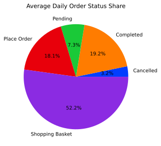

01/01/2017 - 14/03/2018
437 Days 

Completed orders: 40985

---

# Eniac’s Data in Numbers 

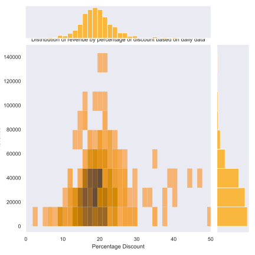

- Up to 97 % discount for an item
- discount mainly around 20/25 %

- 93% of all orders are with discount

- Revenue for the time:  7.8 M € 
- Revenue w/o discounts: 9.3 M €

---
# Discounts vs. Orders 

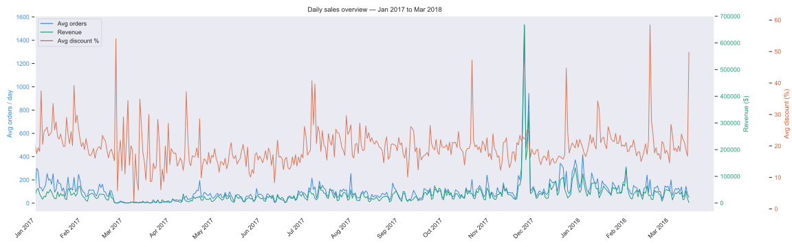

---

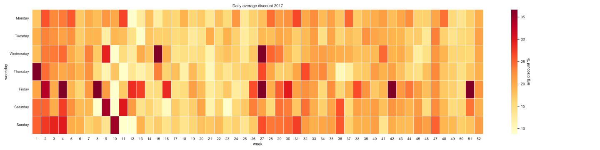
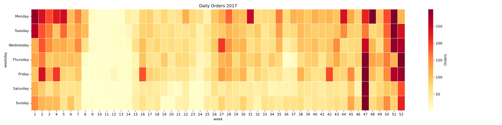
<!-- 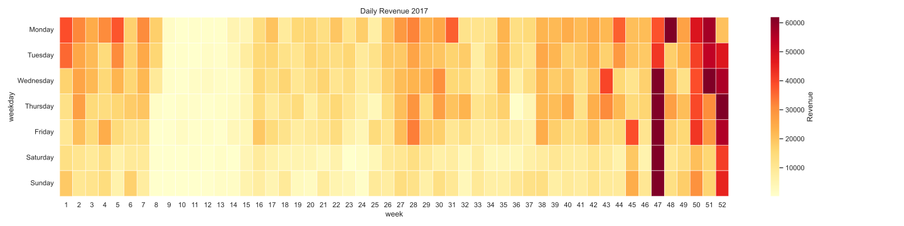 -->

---

<iframe 
  src="plot2.html" 
  width="110%" 
  height="110%" 
  frameborder="0"
  scrolling="no">
</iframe>

---

# Eniac's Products 

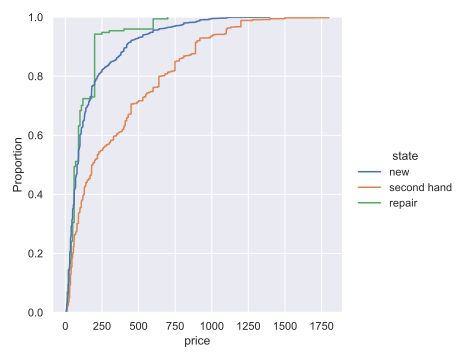

- 90 % of products under 300€
- new, second hand and repaired products 
- 25 % of second hand products over 500€ 

---

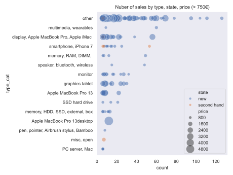

---

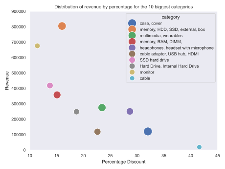
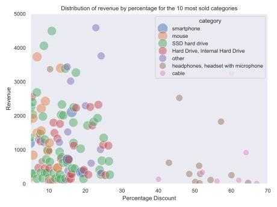

---

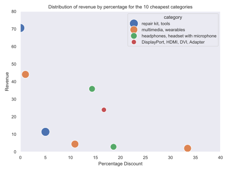
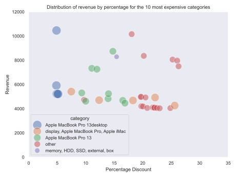

---

<!--- _backgroundColor: --->

<!--- _color: black --->
# Strategy suggestions

- better timing for discounts
- Are discounts in general the solution? 
- focus on high end products for more revenue 

---

<!--[bg contain](figs/box_disc_state.svg)>

